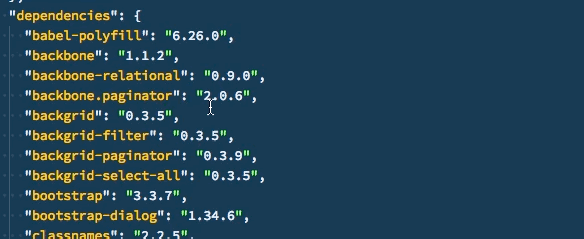

<!--
  Copyright 2015-2018 ForgeRock AS. All Rights Reserved

  Use of this code requires a commercial software license with ForgeRock AS.
  or with one of its affiliates. All use shall be exclusively subject
  to such license between the licensee and ForgeRock AS.
-->

# Access Management (AM) XUI

<!-- TOC depthFrom:2 -->

- [Overview](#overview)
- [Introduction](#introduction)
- [Building the XUI](#building-the-xui)
  - [Prerequisites](#prerequisites)
  - [Available package.json Scripts](#available-packagejson-scripts)
    - [`start`](#start)
    - [`build`](#build)
    - [`test`](#test)
    - [`profile`](#profile)
  - [Polyfills](#polyfills)
  - [Upgrading Dependencies](#upgrading-dependencies)
- [Integrating the XUI Build Process](#integrating-the-xui-build-process)
  - [Building with Maven](#building-with-maven)
    - [Prerequisites](#prerequisites-1)
    - [Description](#description)
    - [Example](#example)
  - [Building with Yarn](#building-with-yarn)
    - [Example](#example-1)

<!-- /TOC -->

## Overview

This module contains the Access Management (AM) user interface, named "XUI". The XUI delivers both user-facing and administration console pages.

This document covers the build process to use when customizing the XUI.

## Introduction

The build process for XUI uses the *Webpack* resource bundler to manage dependencies, optimize deliverables, and package the output.

After making changes to the XUI, for example, editing the JavaScript, templates, or styles, rebuild the project using Webpack.

When complete, you can deploy the rebuilt output to your Access Management instances.

## Building the XUI

This section covers how to build the XUI.

### Prerequisites

- [Node.js][nodejs] (Recommended installed via [NVM][nvm])
- [Yarn][yarn]

With the prerequisites installed, run the following command to download the dependencies the the XUI requires:

```sh
yarn install
```

When complete, you can use the scripts provided in the `package.json` file to build and run the XUI.

### Available package.json Scripts

The XUI provides a number of scripts to help when customizing, building, and testing.

The XUI configuration provides the following scripts:

#### `start`

Starts the XUI in development mode, with auto rebuild and reload enabled.

The `start` script launches a dedicated Webpack development server. The XUI on that dedicated server connects to a separate instance of AM running on a different port, but using the same domain.

Any HTTP requests XUI makes to AM are proxied to port `8080` by default. The XUI behaves as it would in production, except with the addition of development tooling, such as auto browser refreshing when code is changed.

To start developing with the XUI:
1. Start an AM server.
   For example, `http://openam.example.com:8080/openam`.
2. Start an XUI development server by using the `yarn start` command.
   For example, running at `http://xui.example.com:8081`.
3. In a web browser, navigate to the URL of your **AM instance**, but use the _port number_ of the **XUI development server**.
   For example, `http://openam.example.com:8081/openam/XUI/#login`.

> ***Note***
JATO pages redirect to the deployment port of AM - `8080` instead of `8081`.

#### `build`

Performs a one-time build of the XUI, in production mode. Outputs to the `build` directory.

#### `test`

Compiles, runs, and watches the unit tests.

Use this in a separate terminal window to continuously run tests while developing.

#### `profile`

Performs a one-time build of the XUI, in production mode, with profiling enabled.

Generates a report in the `build` directory named `report.html` detailing the structure of the bundles and chunks that were created as part of the production build.

### Polyfills

The babel-preset-env `useBuiltIns` option automatically detects and imports required polyfills.

The regenerator-runtime package provides support for ES2017 `async`/`await`.

### Upgrading Dependencies

Dependencies are "locked" to explicit versions through these mechanisms:

- The dependencies list in `package.json`.
  For example, `"lodash": "4.1.0"` specifies an explicit version, without using `"^"` or `"~"` characters.
- The `yarn.lock` file, generated by Yarn.
  Use the [`yarn outdated`][yarn-outdated] command to view out-of-date dependencies.

> ***Tip***
> [Visual Studio Code][vscode] shows package version information when hovering the cursor within `package.json`, as shown below:
>
> 

## Integrating the XUI Build Process

You can integrate the XUI build with your existing build process.

### Building with Maven

The AM build process uses Maven, and also builds the XUI.

#### Prerequisites

- Maven

#### Description

You can execute the JavaScript build process by using the Maven tool.

Node.js and other supporting tools are installed locally and automatically when building with Maven, and they will not conflict with any globally installed tools.

#### Example

```sh
mvn clean install
```
The output is a ZIP artifact that is expanded and included in the AM .WAR file.

### Building with Yarn

You can execute the JavaScript build process directly by using the Yarn tool.

Node.js and other supporting tools are *not* installed automatically - you will need to manually install Node.js and Yarn.

#### Example

```sh
yarn run build
```
The result is production-ready XUI output in the `build` directory.

[nodejs]: https://nodejs.org/en
[nvm]: https://github.com/creationix/nvm
[vscode]: https://code.visualstudio.com
[yarn-outdated]: https://yarnpkg.com/lang/en/docs/cli/outdated
[yarn]: https://yarnpkg.com
